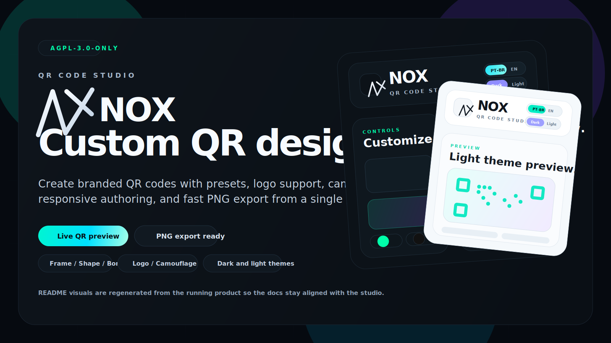

# NOX

[](LICENSE)
[](frontend/package.json)
[](backend/Cargo.toml)
[](docker-compose.yml)

NOX is an open-source visual encoding engine for art-directed QR systems.

The project pairs a polished Next.js studio with a dedicated Rust renderer so creative direction stays in the interface while structural rendering, output discipline, and machine readability remain inside the engine boundary.

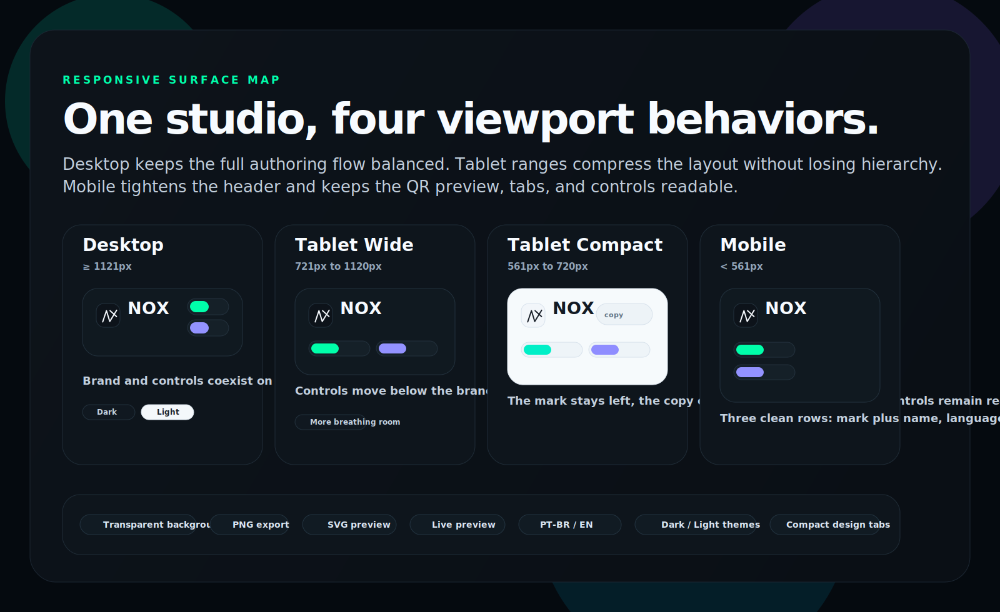

## Highlights

- Art-directed QR studio with three render styles: `square`, `dots`, and `lines`.
- Rust backend responsible for generation, validation, and final SVG plus PNG output.
- Transparent or solid canvas backgrounds with bounded sizes from `256px` to `1024px`.
- Dark and light themes, PT-BR and EN localization, and responsive behavior across desktop, tablet, and mobile ranges.
- Reproducible documentation assets generated from the running product surface through Playwright.

## Gallery

All screenshots below are captured from the local running application and regenerated through the repository scripts.

### Desktop Themes

<p align="center">
  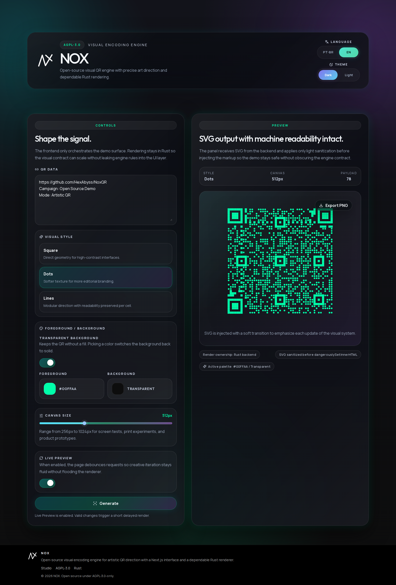
  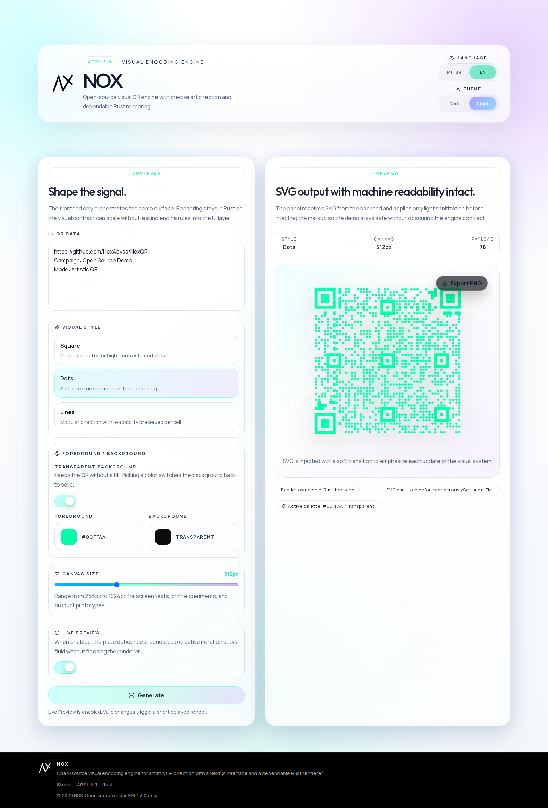
</p>

### Generated Output

<p align="center">
  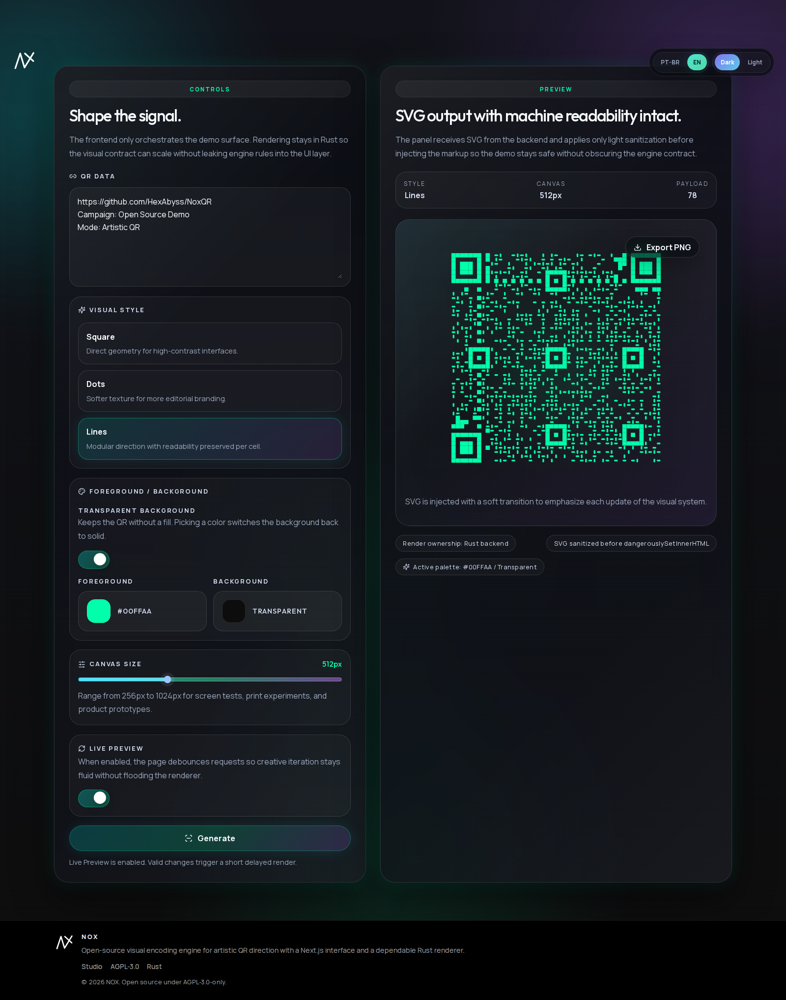
  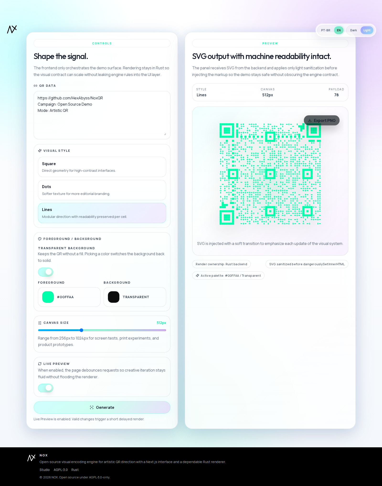
</p>

### Responsive Coverage

<p align="center">
  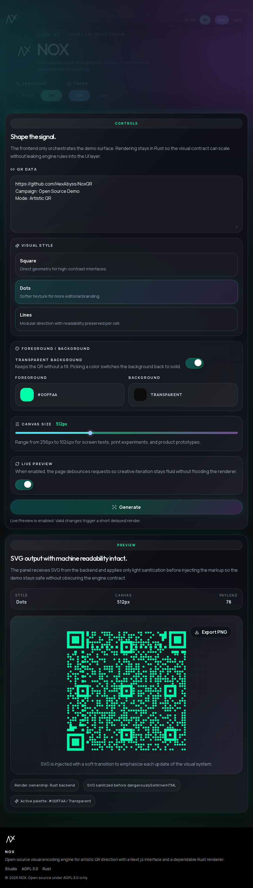
  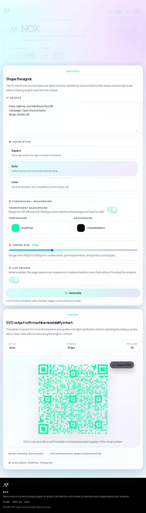
</p>

<p align="center">
  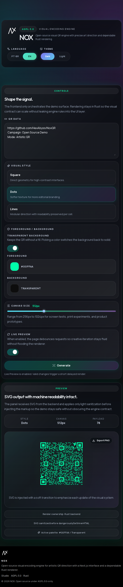
  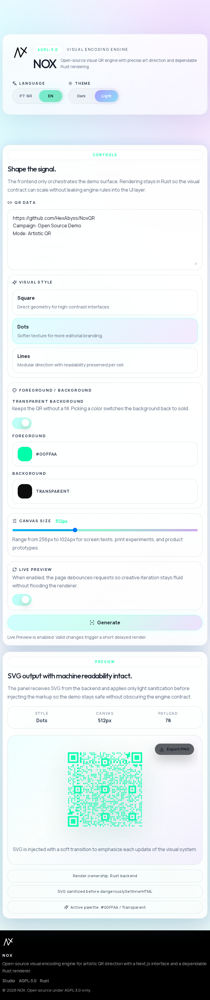
</p>

<p align="center">
  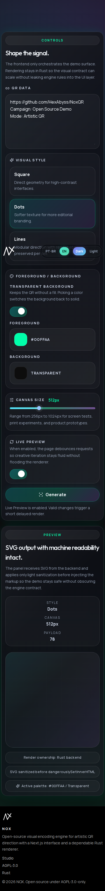
  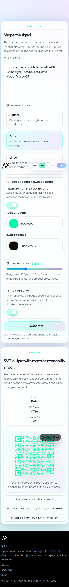
</p>

### Collapsed Header State

<p align="center">
  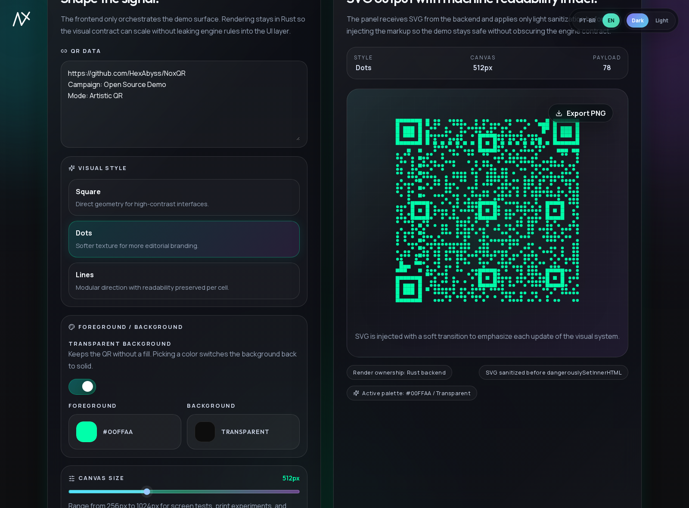
  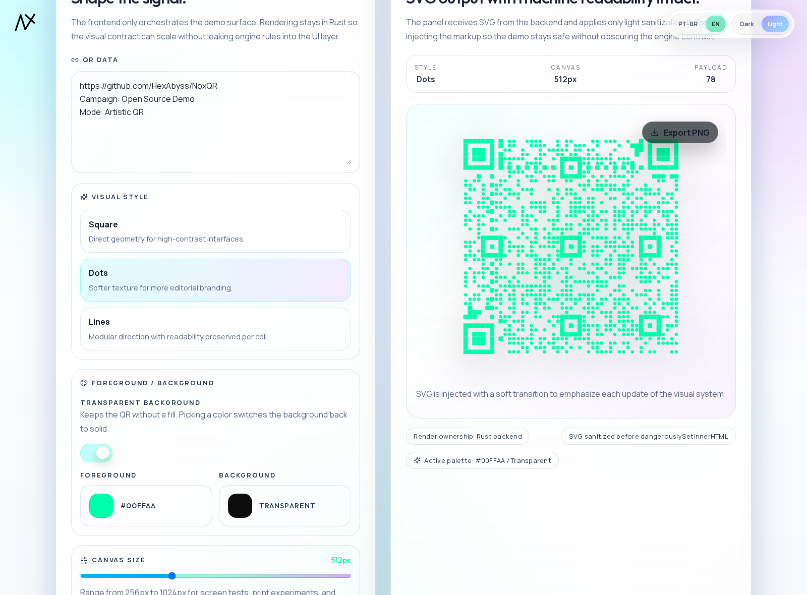
</p>

## Product Model

NOX treats QR generation as a visual system rather than a form utility.

The frontend owns authoring, localization, theme state, motion, and presentation. The backend owns the render contract, QR module geometry, SVG generation, raster export, and runtime endpoints. That split keeps the public codebase readable while still making room for future renderer growth.

## Architecture

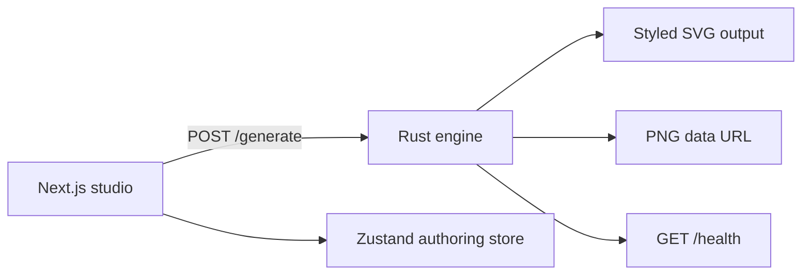

- [frontend/](frontend) contains the studio UI, motion system, API client, and persisted authoring preferences.
- [backend/](backend) contains request validation, renderer selection, SVG composition, PNG export, and HTTP routes.
- [scripts/capture-readme-screenshots.sh](scripts/capture-readme-screenshots.sh) and [scripts/capture-readme-screenshots.mjs](scripts/capture-readme-screenshots.mjs) regenerate the documentation assets from a live local stack.

## Feature Surface

| Area | Current behavior |
| --- | --- |
| Rendering styles | `square`, `dots`, `lines` |
| Outputs | Injected SVG preview and downloadable PNG export |
| Canvas | Solid or transparent background, constrained to `256..1024` |
| Interaction | Debounced live preview plus explicit generate action |
| Localization | `pt-BR` and `en` |
| Themes | `dark` and `light` |
| Responsive header | Desktop `>= 1121`, tablet wide `721..1120`, tablet compact `561..720`, mobile `< 561` |

## API Contract

### `POST /generate`

Request:

```json
{
  "data": "https://example.com",
  "style": "dots",
  "color": "#00FFAA",
  "background": "#0D0D0D",
  "transparent_background": true,
  "size": 512
}
```

Response:

```json
{
  "svg": "<svg>...</svg>",
  "png_base64": "data:image/png;base64,..."
}
```

Notes:

- `style` supports `square`, `dots`, and `lines`.
- `size` is bounded by the backend between `256` and `1024`.
- `png_base64` is returned as a complete data URL, ready for direct download handling in the frontend.

### `GET /health`

Response:

```json
{
  "status": "ok"
}
```

## Quick Start

### Docker

The root compose file is the fastest way to run the full stack.

Public ports:

- frontend: `3080`
- backend: `3081`

```bash
docker compose up --build
```

The frontend is a browser client, so `NEXT_PUBLIC_QR_API_URL` must always point to the backend URL that the browser can actually reach.

### Local Development

Prerequisites:

- Node.js with `npm`
- Rust toolchain with `cargo`

Backend:

```bash
cd backend
cargo run
```

Frontend:

```bash
cd frontend
cp .env.example .env.local
npm install
npm run dev
```

Default frontend environment:

```bash
NEXT_PUBLIC_QR_API_URL=http://localhost:3001
```

## Stack

### Frontend

- Next.js 15
- React 19
- TypeScript
- Framer Motion
- Zustand
- Lucide React

### Backend

- Rust 2021
- Axum 0.7
- Tokio
- tower-http CORS
- qrcode
- image
- serde / serde_json

## Repository Layout

```text
.
├── backend/
│   ├── src/
│   └── Cargo.toml
├── frontend/
│   ├── app/
│   ├── components/
│   ├── lib/
│   ├── public/
│   └── store/
├── docs/
│   └── images/
├── scripts/
│   ├── capture-readme-screenshots.sh
│   └── capture-readme-screenshots.mjs
├── docker-compose.yml
└── README.md
```

## Regenerating Documentation Assets

The repository includes a Playwright-based capture workflow for refreshing the README screenshots and docs imagery.

```bash
docker compose up -d frontend backend
docker pull mcr.microsoft.com/playwright:v1.53.0-noble
bash scripts/capture-readme-screenshots.sh
```

This regenerates the current desktop, tablet, compact tablet, mobile, collapsed-header, and dark/light theme screenshots inside `docs/images/`.

## Deployment Note

GitHub Pages can host the frontend shell, but it cannot run the Rust backend. If you want a public demo:

1. Deploy the backend first on a real host such as Railway, Render, Fly.io, or your own VPS.
2. Point `NEXT_PUBLIC_QR_API_URL` to that public backend URL.
3. Export or deploy the frontend separately with a Pages-friendly Next.js configuration.

The important constraint is simple: the studio can be static, but QR generation still requires a live backend service.

## License

NOX is released under the GNU Affero General Public License v3.0 only.

- You may run, study, and modify the software.
- Distributed modifications must remain under AGPL-3.0-only.
- If you deploy a modified version as a network service, you must provide the corresponding source code.
- The full license text is available in [LICENSE](LICENSE).

The frontend source files include SPDX headers referencing `AGPL-3.0-only`, and both the frontend and backend manifests declare the same license.
