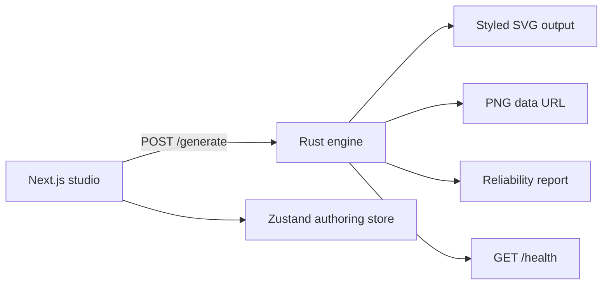

# NOX

[](LICENSE)
[](frontend/package.json)
[](backend/Cargo.toml)
[](docker-compose.yml)

NOX is an open-source QR design studio for branded, art-directed QR codes.

The project combines a polished Next.js interface with a dedicated renderer so content, styling, preview, and export stay fast and consistent inside one focused product surface.


## Highlights

- Step-based QR studio with a content-type strip, automatic payload assembly, and visual-first authoring instead of text-heavy collapsible forms.
- Art-directed QR studio with eight render styles: `square`, `dots`, `lines`, `triangles`, `hexagons`, `blobs`, `glyphs`, and `fractal`.
- Guided visual design tabs for `Frame`, `Shape`, `Border`, `Logo`, `Camouflage`, and `Presets`, using the same compact tile language across the studio.
- Rust backend split into `api`, `engine`, `core`, `render`, and `validation` responsibilities.
- Phase 1 matrix modeling with per-module roles and importance scoring, so the QR is treated as structure rather than a flat bitmap.
- Phase 2 renderer abstraction with controlled module transforms, expressive primitives, and strict preservation of reading patterns.
- Phase 3 reliability engine with post-render scoring, hostile scan simulations, and conservative auto-correction before the response is returned.
- Phase 4 artistic system with curated presets, image-guided texture mapping, camouflaged data modules, and protected center-logo embedding.
- Phase 5 perception layer with carrier-image upload, near-invisible and guide-driven QR modes, plus reliability feedback surfaced back to the studio.
- Frontend composition layer for decorative frames, finder-eye overlays, gradients, and PNG export parity without widening the backend contract.
- Transparent or solid canvas backgrounds with bounded sizes from `256px` to `1024px`, now defaulting to transparent on every fresh page entry.
- Dark and light themes, PT-BR and EN localization, and responsive behavior across desktop, tablet, and mobile ranges.
- Inline upload handling for carrier images and center logos, plus a preview loader that replaces stale QR output while a new render is in flight.
- Standardized logo and camouflage menus with clearer upload, preset, and adjustment grouping.
- Automated coverage across backend unit tests, frontend typecheck, and full-stack regression for backend contract, reliability telemetry, export flow, theme behavior, and mobile layout stability.
- Reproducible documentation assets generated from the running product surface through Playwright.

## Gallery

All screenshots below are captured from the local running application and regenerated through the repository scripts.

### Desktop Themes

<p align="center">
  
  
</p>

### Generated Output

<p align="center">
  
  
</p>

### Responsive Coverage

<p align="center">
  
  
</p>

<p align="center">
  
  
</p>

<p align="center">
  
  
</p>

### Design Detail States

<p align="center">
  
  
</p>

## Product Model

NOX treats QR generation as a visual product surface rather than a plain form utility.

The interface is centered on content, styling, preview, and export so users can build a QR code quickly without navigating technical implementation details.

## Engine Status

NOX currently ships the first six implementation layers of the roadmap:

- Phase 0: structural backend split into `api`, `engine`, `core`, `render`, and `validation`
- Phase 1: matrix parsing into semantic module roles plus importance scoring for controlled styling
- Phase 2: modular renderer engine with multiple primitives and local geometric transforms
- Phase 3: reliability analysis with contrast, distortion, density, quiet zone, and scan simulation feedback
- Phase 4: artistic presets, image-guided QR surfacing, camouflaged render treatment, and smart logo embedding
- Phase 5: perception modes, carrier-image guidance, phase-aware frontend controls, and runtime reliability reporting for aggressive artistic outputs

For a deeper technical breakdown, see [docs/engine-overview.md](docs/engine-overview.md) and [docs/testing.md](docs/testing.md).

## Architecture



- [frontend/](frontend) contains the studio UI, motion system, API client, and persisted authoring preferences.
- [backend/](backend) contains the Phase 0-4 engine: request handlers in `api`, orchestration in `engine`, QR structure logic in `core`, renderer primitives and styles in `render`, and guardrails plus reliability scoring in `validation`.
- [tests/e2e/regression.spec.mjs](tests/e2e/regression.spec.mjs) exercises the live stack through Playwright and HTTP smoke checks.
- [scripts/run-backend-unit-tests.sh](scripts/run-backend-unit-tests.sh) runs Rust unit tests in a disposable container, even when `cargo` is not installed locally.
- [scripts/run-frontend-typecheck.sh](scripts/run-frontend-typecheck.sh) validates the frontend contract in an isolated Node container.
- [scripts/run-regression-tests.sh](scripts/run-regression-tests.sh) brings up the stack, runs the full regression suite end to end, and cleans up containers automatically by default.
- [scripts/run-test-battery.sh](scripts/run-test-battery.sh) runs backend unit tests, frontend typecheck, and end-to-end regression in sequence.
- [scripts/capture-readme-screenshots.sh](scripts/capture-readme-screenshots.sh) and [scripts/capture-readme-screenshots.mjs](scripts/capture-readme-screenshots.mjs) regenerate the documentation assets from a live local stack.

## Feature Surface

| Area | Current behavior |
| --- | --- |
| Rendering styles | `square`, `dots`, `lines`, `triangles`, `hexagons`, `blobs`, `glyphs`, `fractal` |
| Art direction | `manual`, `neon`, `ink`, `wireframe`, `cyberpunk`, `minimal`, and `organic` presets with camouflage, center logo, carrier-image upload, and perception modes `off`, `near_invisible`, `frequency`, `negative`, `encrypted`, `multi_layer` |
| Content authoring | `link`, `text`, `email`, `call`, `sms`, `vcard`, `whatsapp`, `wifi`, `app`, `event`, `barcode_2d` |
| Visual composition | Step-based `Frame`, `Shape`, `Border`, `Logo`, `Camouflage`, and `Presets` tabs with frame presets, finder styles, upload-driven art direction, and logo presets |
| Outputs | Live preview and downloadable PNG export |
| Reliability | Score, risk, simulation results, suggestions, and conservative auto-correction |
| Canvas | Solid or transparent background, constrained to `256..1024` |
| Interaction | Debounced live preview, stale-preview loading gate, explicit generate action, icon-first selection grids, and step-based studio flow |
| Localization | `pt-BR` and `en` |
| Themes | `dark` and `light` |
| Responsive header | Desktop `>= 1121`, tablet wide `721..1120`, tablet compact `561..720`, mobile `< 561` |
| Regression safety | Backend unit tests, frontend typecheck, and Compose-backed Playwright end-to-end checks |

## API Contract

### `POST /generate`

Request:

```json
{
  "data": "https://example.com",
  "style": "dots",
  "color": "#00FFAA",
  "background": "#0D0D0D",
  "transparent_background": true,
  "size": 512,
  "preset": "neon",
  "camouflage": 0.18,
  "perception_mode": "near_invisible",
  "perception_strength": 0.58,
  "reference_image": "data:image/png;base64,...",
  "logo_image": "data:image/png;base64,...",
  "logo_scale": 0.22
}
```

Response:

```json
{
  "svg": "<svg>...</svg>",
  "png_base64": "data:image/png;base64,...",
  "validation": {
    "score": 0.91,
    "risk": "low",
    "metrics": {
      "contrast_ratio": 12.2,
      "distortion": 0.08,
      "density": 0.31,
      "quiet_zone_integrity": 1.0,
      "simulation_pass_rate": 1.0
    },
    "simulations": [
      { "name": "baseline", "passed": true },
      { "name": "blur", "passed": true },
      { "name": "distance", "passed": true },
      { "name": "low_light", "passed": true }
    ],
    "corrections_applied": [],
    "suggestions": [],
    "auto_corrected": false
  }
}
```

Notes:

- `style` supports `square`, `dots`, `lines`, `triangles`, `hexagons`, `blobs`, `glyphs`, and `fractal`.
- `preset` supports `manual`, `neon`, `ink`, `wireframe`, `cyberpunk`, `minimal`, and `organic`.
- `camouflage` is normalized by the backend between `0.0` and `1.0`.
- `perception_mode` supports `off`, `near_invisible`, `frequency`, `negative`, `encrypted`, and `multi_layer`.
- `perception_strength` is normalized by the backend between `0.0` and `1.0`.
- `reference_image` and `logo_image` accept PNG, JPEG, or WebP data URLs up to `2MB` and `2048px` per side.
- `reference_image` acts as a carrier image for the perception layer, and the frontend automatically falls back to `off` when no carrier image is present.
- `logo_scale` is enforced between `0.14` and `0.30` when a logo is embedded.
- The frontend translates backend validation and reliability text at runtime so PT-BR and EN stay aligned without changing the API shape.
- `size` is bounded by the backend between `256` and `1024`.
- `png_base64` is returned as a complete data URL, ready for direct download handling in the frontend.
- `validation` is computed from the actual rendered output, not just from request-time heuristics.
- `simulations` currently cover baseline decode, blur, distance reconstruction, and low-light degradation.
- `corrections_applied` records when the engine falls back to a more conservative render bias to preserve scan reliability.

### `GET /health`

Response:

```json
{
  "status": "ok"
}
```

## Quick Start

### Docker

The root compose file is the fastest way to run the full stack.

Public ports:

- frontend: `3080`
- backend: `3081`

```bash
docker compose up --build
```

The frontend is a browser client, so `NEXT_PUBLIC_QR_API_URL` must always point to the backend URL that the browser can actually reach.

### Local Development

Prerequisites:

- Node.js with `npm`
- Rust toolchain with `cargo`

Backend:

```bash
cd backend
cargo run
```

Frontend:

```bash
cd frontend
cp .env.example .env.local
npm install
npm run dev
```

Default frontend environment:

```bash
NEXT_PUBLIC_QR_API_URL=http://localhost:3001
```

## Automated Testing

The project now includes a local three-layer test battery plus CI regression coverage so changes fail loudly instead of drifting silently.

Backend unit tests:

```bash
bash scripts/run-backend-unit-tests.sh
```

Frontend typecheck:

```bash
bash scripts/run-frontend-typecheck.sh
```

Full-stack regression suite:

```bash
bash scripts/run-regression-tests.sh
```

Complete local battery:

```bash
bash scripts/run-test-battery.sh
```

The end-to-end suite validates:

- `GET /health` and `POST /generate` across every supported renderer style
- SVG, PNG, and reliability contract stability
- Reliability telemetry visibility in the frontend preview
- Light theme export button styling
- Dark theme export button styling
- Mobile preview containment and horizontal overflow regressions

The regression script tears down the Compose stack automatically. For debugging, set `NOX_E2E_KEEP_STACK=1` before running it.

`test-results/` is generated output from Playwright and is ignored by git. It should be treated as an execution artifact, not as source.

GitHub Actions runs backend unit tests and full-stack regression through [.github/workflows/regression.yml](.github/workflows/regression.yml) on pushes, pull requests, and manual dispatches.

## Stack

### Frontend

- Next.js 15
- React 19
- TypeScript
- Framer Motion
- Zustand
- Lucide React

### Backend

- Rust 2021
- Axum 0.7
- Tokio
- tower-http CORS
- qrcode
- image
- serde / serde_json

## Repository Layout

```text
.
├── .github/
│   └── workflows/
│       └── regression.yml
├── backend/
│   ├── src/
│   │   ├── api/
│   │   ├── core/
│   │   ├── engine/
│   │   ├── render/
│   │   └── validation/
│   └── Cargo.toml
├── frontend/
│   ├── app/
│   ├── components/
│   ├── lib/
│   ├── public/
│   └── store/
├── docs/
│   ├── engine-overview.md
│   ├── testing.md
│   └── images/
├── scripts/
│   ├── run-backend-unit-tests.sh
│   ├── run-frontend-typecheck.sh
│   ├── run-regression-tests.sh
│   └── run-test-battery.sh
├── tests/
│   └── e2e/
│       └── regression.spec.mjs
├── docker-compose.yml
└── README.md
```

## Regenerating Documentation Assets

The repository includes a Playwright-based capture workflow for refreshing the README screenshots and docs imagery.

```bash
docker compose up -d frontend backend
docker pull mcr.microsoft.com/playwright:v1.53.0-noble
bash scripts/capture-readme-screenshots.sh
```

This regenerates the current desktop, tablet, compact tablet, mobile, and design-detail screenshots inside `docs/images/`.

The latest captures also reflect the new visual studio states, including frame/finder styling and logo-library views, so the documentation matches the current UI behavior.

## Additional Docs

- [docs/engine-overview.md](docs/engine-overview.md) documents the Phase 0-2 architecture, module roles, and renderer system.
- [docs/testing.md](docs/testing.md) documents the test layers, scripts, CI behavior, and generated artifacts.

## Deployment Note

GitHub Pages can host the frontend shell, but it cannot run the Rust backend. If you want a public demo:

1. Deploy the backend first on a real host such as Railway, Render, Fly.io, or your own VPS.
2. Point `NEXT_PUBLIC_QR_API_URL` to that public backend URL.
3. Export or deploy the frontend separately with a Pages-friendly Next.js configuration.

The important constraint is simple: the studio can be static, but QR generation still requires a live backend service.

## License

NOX is released under the GNU Affero General Public License v3.0 only.

- You may run, study, and modify the software.
- Distributed modifications must remain under AGPL-3.0-only.
- If you deploy a modified version as a network service, you must provide the corresponding source code.
- The full license text is available in [LICENSE](LICENSE).

The frontend source files include SPDX headers referencing `AGPL-3.0-only`, and both the frontend and backend manifests declare the same license.
